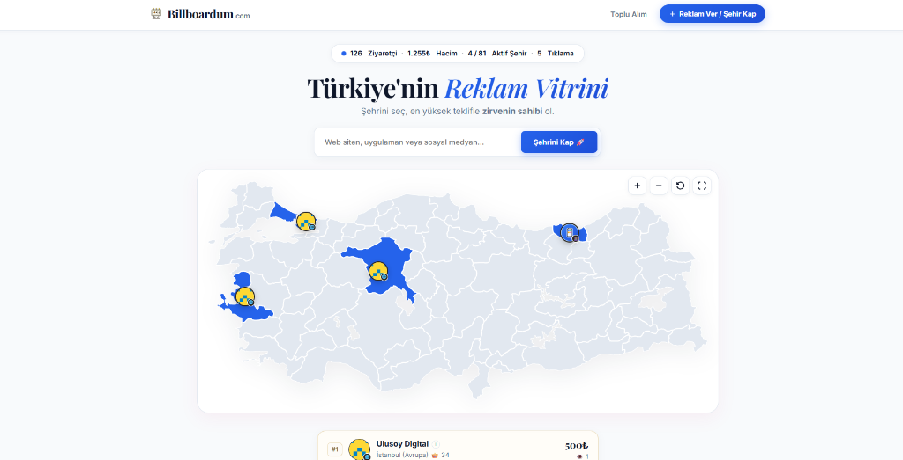

# 🏙️ Billboardum — 81 İl İnteraktif Dijital Reklam & Açık Artırma (Outbid) Platformu

<p align="center">
  
</p>

<p align="center">
  <a href="https://github.com/muqo16/billboardum/blob/main/LICENSE"></a>
  
  
</p>

---

## 📖 Proje Hakkında

**Billboardum**, Türkiye'nin 81 ilini dijital billboard alanlarına dönüştüren; interaktif vektörel SVG haritası üzerinden çalışan, modern açık artırma (Outbid) ve reklam platformudur.

Platformda her il bir reklam vitrinidir. Bir şehre o anki en yüksek teklifi veren marka/kullanıcı **Zirve Lideri** rozetini devralır ve harita üzerinde dairesel pin olarak logonuzla canlı sergilenir. Yeni bir rakip daha yüksek bir teklif verdiğinde şehri devralır (Outbid) ve önceki lider alt teklifler listesine aktarılır.

---

## ✨ Öne Çıkan Özellikler

- 🗺️ **81 İl Responsive SVG Vektörel Harita:** 
  - Harita içine entegre edilmiş dairesel şirket pinleri, canlı taç animasyonları ve il merkezlerine matematiksel olarak kilitlenen pin yerleşimi.
  - Tek tıkla tam ekran modu, mouse tekerleğiyle yakınlaştırma (Zoom In / Zoom Out) ve serbest sürükleme (Drag & Pan).
- ⚡ **Hızlı Devralma (Outbid) ve Alt İlanlar Çekmecesi (Drawer Modal):**
  - İl tıklandığında sayfa yenilenmeden açılan şık sağ çekmece.
  - Zirvedeki lider markanın profil kartı, tıklanabilir yönlendirme butonu ve o ile ait geçmiş teklif geçmişi (2., 3., 4. sıralar).
- 🖼️ **Sıfır-Güven (Zero-Trust) Resim Yeniden Kodlama Motoru:**
  - `reencode_and_clean_image()` motoru: Yüklenen logo ve dekontlar doğrudan diske kaydedilmez. PHP GD kütüphanesi piksel verisini RAM'e okuyup sıfırdan temiz bir resim tuvali oluşturarak diske basar.
  - Resim içerisine gizlenmiş tüm Python/PHP scriptleri, polyglot yükleri veya zararlı kodlar **fiziksel olarak %100 yok edilir**.
  - Sahte veya bozuk dosyalar anında reddedilir.
  - Logo yüklemek tamamen opsiyoneldir; logo seçilmediğinde seçilen platforma göre (Web, Instagram, X vb.) şık standart platform logosu atanır.
- 🏆 **Zirve Sıralaması Canlı Kategori Filtreleme:**
  - *Tümü, Siteler, Uygulamalar, Instagram, YouTube, X, Facebook* sekmeleri tıklandığında sayfa yenilenmeden anında canlı filtreleme.
  - Kategori bazında madalyalar (🥇, 🥈, 🥉, #4...) dinamik olarak yeniden hesaplanır.
- 🛡️ **Gizli Admin Giriş Kapısı (Admin Gatekeeper & URL Obscurity):**
  - Standart `/admin/` yoluna gitmeye çalışan tüm yabancılara ve tarayıcı botlarına doğrudan **HTTP 404 Sayfa Bulunamadı** yanıtı döndürülür.
  - Yönetici ekranı yalnızca özel gizli anahtar ile (`/admin/?key=bb_admin_2026`) görünür hale gelir.
  - URL'deki anahtar tarayıcı geçmişine sızmaması için anında temizlenir.
- 🔐 **Bcrypt Şifreleme ve Kaba Kuvvet (Brute-Force) Kalkanı:**
  - Yönetici ve kullanıcı şifreleri modern Bcrypt algoritması ile tuzlanarak hashlenir.
  - IP bazlı kilit mekanizması ile hatalı denemelerde geçici kilit devreye girer.
- 💳 **Esnek Ödeme Entegrasyonu:**
  - IBAN Havale / EFT bildirimi (Dekont yükleme desteği ve Admin Onay Paneli).
  - Stripe Kredi Kartı ödeme altyapısı (Admin panelinden tek tıkla açılıp kapanabilir).

---

## 🚀 Canlı Sunucuya Kurulum (cPanel / Apache / Nginx)

### 1. Dosyaları Sunucuya Aktarma
1. Bu depodaki dosyaları sunucunuzun `public_html` (veya web kök) dizinine yükleyin.
2. cPanel Dosya Yöneticisi ile yüklüyorsanız zip olarak yükleyip **"Extract"** yapabilirsiniz.

### 2. PHP Sürümü & Gerekli Eklentiler
- **PHP Sürümü:** PHP 8.1, 8.2, 8.3 veya 8.4 önerilir.
- **Aktif Olması Gereken PHP Eklentileri:**
  - `pdo_sqlite` (Hızlı, sıfır-konfigürasyon SQLite veritabanı için)
  - `gd` (Sıfır-Güven resim re-encode motoru için)
  - `fileinfo` (MIME doğrulaması için)
  - `mbstring` (Türkçe karakter işleme için)

### 3. Klasör İzinleri (CHMOD)
```bash
chmod 755 database/
chmod 664 database/billboardum.db
chmod 755 uploads/
chmod 755 uploads/logos/
chmod 755 uploads/receipts/
```

### 4. Alan Adı Ayarı
`config.php` dosyasını açıp alan adınızı tanımlayın:
```php
define('SITE_DOMAIN', 'alanadiniz.com');
```
*(Dilerseniz `.env` dosyası oluşturarak kodlara hiç dokunmadan sunucu ortam değişkenlerinden de yönetebilirsiniz).*

---

## 💻 Yerel Geliştirme (Localhost)

Hiçbir Apache veya MySQL sunucusu kurmanıza gerek kalmadan dahili PHP sunucusu ile saniyeler içinde çalıştırabilirsiniz:

```bash
# Proje dizinine girin
cd billboardum

# PHP dahili sunucusunu başlatın
php -S 127.0.0.1:8000 router.php
```

Tarayıcınızdan açın: `http://127.0.0.1:8000`

---

## 🔑 Admin Paneline Giriş

- **Giriş URL'si (Gizli Kapı):** `http://siteniz.com/admin/?key=bb_admin_2026`
- **Varsayılan Şifre:** `admin123`

> [!IMPORTANT]
> Admin paneline giriş yaptıktan sonra **"Site Ayarları"** (`/admin/settings.php`) sayfasından varsayılan şifrenizi ve gizli anahtarınızı kendinize özel olarak değiştirmeyi unutmayınız.

---

## 🛡️ Güvenlik Mimarisi

- **SQLite Direct Download Prevention:** `.htaccess` kuralları ile `.db`, `.sqlite`, `.sql`, `.log`, `.env` uzantılarına dışarıdan doğrudan erişim **403 Forbidden** ile engellenmiştir.
- **Zero-Trust Image Sanitation:** Yüklenen görseller PHP GD ile piksel bazında yeniden sentezlenir; steganografi ve polyglot scriptler tamamen silinir.
- **SQL Injection Koruması:** PDO Prepared Statements mimarisi.
- **CSRF Koruması:** Tüm admin ve teklif formlarında kriptografik CSRF belirteçleri.
- **XSS Koruması:** SVG XML parser ve HTML çıktı temizleme sanitasyonu.
- **Oturum Güvenliği:** `HttpOnly`, `SameSite=Lax`, `X-Frame-Options: SAMEORIGIN`, `X-Content-Type-Options: nosniff`.

---

## 📄 Lisans

Bu proje [MIT Lisansı](LICENSE) ile lisanslanmıştır. Dilediğiniz gibi ticari veya kişisel projelerinizde özgürce kullanabilir, geliştirebilir ve dağıtabilirsiniz.

---

<p align="center">
  Geliştirici: <b>Muzaffer Ulusoy</b> (<a href="https://github.com/muqo16">@muqo16</a>) • <a href="https://ulusoydigital.com">ulusoydigital.com</a>
</p>